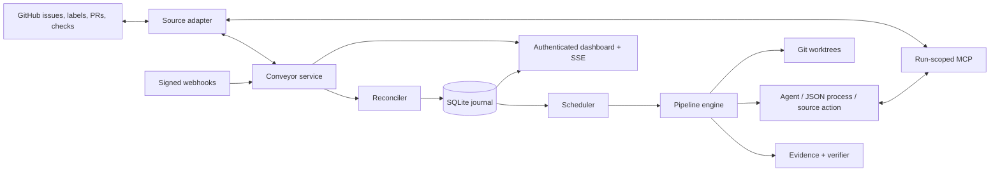

# Conveyor

[](./LICENSE)
[](https://bun.sh/)

Conveyor is a GitHub-native autonomous software delivery orchestrator for a trusted server. Issues remain the source of truth while configurable agents, deterministic checks, scripts, and source actions move work through a delivery pipeline.

It is deliberately smaller than a general workflow platform: one Bun process, one SQLite database, isolated Git worktrees, scoped MCP tools, and a server-rendered operations dashboard.


## What Conveyor does

Conveyor watches configured GitHub repositories and projects enrolled issues onto a durable delivery board. For each runnable issue it can:

1. verify that the issue is ready to enter its current stage;
2. create or reuse an isolated feature worktree;
3. run a Codex agent, a strict JSON process, or an idempotent source action;
4. verify the result against current acceptance criteria;
5. return actionable feedback to the producer when verification fails;
6. checkpoint the successful attempt and advance the GitHub stage label;
7. create and merge pull requests through configured lifecycle actions;
8. run repository-defined deployment and post-deployment verification;
9. retain a concise user conversation separately from technical logs.

Stages have no built-in names or meanings. A pipeline may model refinement, implementation, review, merge, deployment, cleanup, or a completely different sequence.

## Design principles

- **GitHub is authoritative.** Issues, labels, relationships, pull requests, and checks are reconciled from the source rather than replaced by a second issue tracker.
- **Configuration defines behavior.** Stages, agents, checks, concurrency, retry policy, labels, and lifecycle actions live outside managed repositories.
- **Every stage is verified.** A verifier is independent from the producer and can use deterministic evidence gathered by a script.
- **Runs are least-privilege.** Every agent receives a per-run MCP server exposing only its configured tools and issue context.
- **Work is isolated.** Feature changes happen in Git worktrees; Conveyor does not edit a repository's primary checkout.
- **Progress is durable.** SQLite journals runs, attempts, transitions, questions, costs, source mutations, and conversation messages.
- **External mutations are idempotent.** Pull-request and label operations are recorded so retries and restarts do not repeat successful actions.
- **Humans stay in control.** Conveyor never directly closes an issue. It can mark completed open issues as closable and let GitHub close an issue through an ordinary PR reference.

## Architecture



### Engine components

| Component | Responsibility |
| --- | --- |
| Configuration loader | Recursively loads split YAML, resolves paths relative to their declaring file, rejects duplicate definitions, validates cross-references, and computes a stable configuration hash. |
| GitHub source adapter | Reads issues and relationships, manages only configured labels/body sections, observes pull requests and checks, verifies webhooks, and performs idempotent source actions. |
| Reconciler | Rebuilds the local projection from GitHub, detects enrollment and label drift, and wakes work after webhook or polling changes. |
| Scheduler | Selects eligible issues while enforcing global, repository, and stage concurrency plus parent/dependency constraints. |
| Workspace manager | Creates issue-specific Git worktrees and branches without changing the primary checkout. |
| Pipeline engine | Runs entry checks, one producer, exit checks, feedback cycles, lifecycle actions, checkpoints, and configured correction transitions. |
| Codex runner | Starts non-interactive structured agent runs with a chosen model, effort level, sandbox, approvals policy, output schema, and scoped MCP configuration. |
| JSON-process runner | Executes repository-defined programs that accept JSON on stdin and return exactly one validated JSON result. |
| Scoped MCP server | Gives each live run only its allowed issue, reporting, source-mutation, delivery, and workspace tools. Grants expire with the run. |
| SQLite store | Persists source projections, stage state, attempts, events, transitions, questions, costs, artifacts, leases, and idempotency records in WAL mode. |
| Web control plane | Serves an authenticated Preact dashboard, issue conversations, questions, stage history, technical logs, steering runs, health endpoints, and live SSE refresh. |
| Idle deployment helper | Waits for a durable idle boundary before restarting a service and verifies its liveness afterward. |

## Dashboard

The board shows backlog, configured stages, completed work, active runner capacity, dependency/child relationships, warnings, questions, and per-stage cost. Issue dialogs separate four concerns:

- **Summary** — current state, relationships, criteria, labels, cost, and duration.
- **Conversation** — concise owner and agent handoff messages that survive future runs.
- **Journey** — stage transitions, corrections, stops, and their reasons.
- **Technical logs** — paginated raw run events for debugging.

The optional steering agent is intentionally quieter than the technical log. Only explicit MCP progress and the final report are shown; commands, tool calls, raw output, and private reasoning are not rendered.


## Issue and pipeline model

An issue is enrolled with the configured base label (by default `conveyor`). A stage label such as `conveyor:implementation` projects it into a pipeline stage. State labels represent stopped or terminal conditions, and an order label provides durable backlog ordering.

Removing the enrollment label pauses execution without erasing the issue. Removing every Conveyor-prefixed label offboards it from the dashboard. Ambiguous, unknown, or conflicting labels are shown under **Needs attention** rather than guessed.

Parents are roll-ups: they do not consume runner capacity while children remain. Their source stage and board column follow the earliest pipeline stage occupied by an unfinished child, and the board separates them from executable issues within that column. Dependencies prevent an issue from running until the required issues are satisfied. A refinement stage may create child issues and place them directly into a later stage so independent slices can run in parallel.

Every executable stage has one producer:

- an agent;
- a JSON process; or
- a source action.

Optional entry and exit checks combine deterministic evidence with an independent verifier. Failed exit verification can trigger a bounded fresh producer attempt. A configured failure policy can return work to the previous stage—for example, review feedback returning to implementation.

## Run-scoped MCP

Agents never receive unrestricted control-plane access. Conveyor creates an ephemeral MCP context containing the current issue, repository, workspace, delivery state, source guidance, and an allowlist selected from:

- read tools for the issue, workspace, delivery state, and shared conversation;
- user-facing progress, questions, blockers, milestones, rationale, results, and artifacts;
- constrained label, acceptance-criteria, hierarchy, dependency, comment, and PR metadata changes;
- scoped workspace fetch, push, and artifact operations.

Source and workspace mutations pass back through the Conveyor service, where scope, idempotency, and branch rules are enforced. Verifiers receive a read/report-only subset even if their agent definition lists mutation tools.

## Reliability and recovery

- SQLite uses durable WAL-backed state and records each stage attempt with the configuration hash that created it.
- Successful stage checkpoints are not silently rerun after restart.
- Interrupted runs are recovered into schedulable state.
- Infrastructure and usage-limit retries are separate and use configurable bounded backoff.
- Source mutations carry idempotency keys.
- Reconciliation repairs stale projections from GitHub and refuses ambiguous configuration drift.
- Requirement changes do not interrupt a producer. The next verifier reads the latest issue state and can request correction.
- Full run activity is retained independently from the concise shared conversation.

## Security boundary

Conveyor is intended for a trusted single-user server, not hostile multi-tenant execution.

- The dashboard uses a scrypt password hash, signed `HttpOnly`/`SameSite=Strict` sessions, and CSRF protection.
- Public deployments should sit behind a TLS reverse proxy; secure cookies are enabled when `web.publicUrl` is HTTPS.
- GitHub webhooks are verified with HMAC-SHA256.
- Internal MCP requests use random bearer grants scoped to one live run and an explicit tool allowlist.
- Agent prompts identify issue content as requirements rather than privileged system instructions.
- Worktree and branch operations are constrained to the run's configured repository and feature branch.
- Secrets, runtime configuration, databases, logs, artifacts, and managed worktrees are deliberately excluded from this repository.

## Requirements

- Linux or another environment supported by Bun
- [Bun](https://bun.sh/) 1.4 or newer
- Git
- [GitHub CLI](https://cli.github.com/) authenticated for configured repositories
- Codex CLI for Codex-backed agents
- Existing local clones of managed repositories; v0.1 does not clone them automatically

## Install and verify

```sh
git clone https://github.com/Abaniumbay/conveyor.git
cd conveyor
bun install --frozen-lockfile
bun run check
```

Keep configuration and agent instructions outside the source checkout. A common layout is:

```text
/srv/conveyor/
├── config/
│   ├── core.yaml
│   ├── agents.yaml
│   ├── pipelines.yaml
│   ├── repositories.yaml
│   └── instructions/
└── state/
    ├── conveyor.sqlite
    ├── logs/
    ├── artifacts/
    └── worktrees/
```

Configuration can be one YAML file or a directory of YAML files. Named sections merge by unique key; singleton sections such as `settings`, `web`, and `labels` may be declared only once.

```yaml
settings:
  runners: 4
  database: ../state/conveyor.sqlite
  logs: ../state/logs
  workspaces: ../state/worktrees
  artifacts: ../state/artifacts
  reconcileInterval: 5m
  feedbackCycles: 2
  retries:
    infrastructureAttempts: 5
    usageLimitAttempts: unlimited
    minBackoff: 30s
    maxBackoff: 30m

web:
  listen: 127.0.0.1:4300

sources:
  github:
    type: github
    webhookPath: /hooks/github
    autoConfigureWebhook: false

runners:
  codex:
    type: codex
    command: codex
    sandbox: workspace-write
    automaticApprovals: true

agents:
  implementer:
    name: Implementer
    title: Software Engineer
    runner: codex
    effort: high
    instructions: ./instructions/implementer.md
    tools:
      - source.get_issue
      - source.get_guidance
      - workspace.get_context
      - delivery.get_state
      - conversation.get
      - run.report_progress
      - run.ask_question
      - workspace.request_fetch
      - workspace.request_push
  verifier:
    name: Verifier
    title: Quality Engineer
    runner: codex
    effort: high
    instructions: ./instructions/verifier.md
    workspaceAccess: read-only

checks:
  verify:
    verifier: verifier

labels:
  enrollment: conveyor
  stageTemplate: "conveyor:{stage}"
  states:
    done: conveyor:done
    blocked: conveyor:blocked
    rejected: conveyor:rejected
    error: conveyor:error
    needs-input: conveyor:needs-input
  metadata:
    closable: conveyor:closable
    orderTemplate: "conveyor:order:{number}"

pipelines:
  default:
    successStatuses: [done, skipped]
    failureStatuses: [blocked, rejected, error, needs-input, changes-requested]
    stages:
      - id: implementation
        run: { agent: implementer }
        concurrency: 2
        enterCheck: verify
        exitCheck: verify
        feedbackCycles: 2
      - id: review
        run: { agent: verifier }
        concurrency: 2
        enterCheck: verify
        exitCheck: verify
        failurePolicies:
          changes-requested: { action: returnToPrevious }

repositories:
  example:
    source: github
    address: example/project
    folder: /srv/repositories/project
    baseBranch: main
    pipeline: default
    concurrency: 2
```

Validate before starting:

```sh
bun run src/cli.ts check-config --config /srv/conveyor/config
bun run src/cli.ts hash-password --password 'choose-a-strong-password'
```

Set the runtime environment through your service manager or secret store:

```text
CONVEYOR_USERNAME
CONVEYOR_PASSWORD_HASH
CONVEYOR_SESSION_SECRET
CONVEYOR_GITHUB_WEBHOOK_SECRET   # required only when webhook installation is enabled
```

Then run:

```sh
bun run src/cli.ts serve --config /srv/conveyor/config
```

`GET /health/live` is public for process supervision. Readiness, operational data, and the dashboard require authentication.

## Repository map

```text
src/
├── app/          service orchestration, issue execution, and configured stage runtime
├── config/       YAML loading, normalization, hashing, and validation
├── core/         issue projection, scheduling, pipeline execution, and transitions
├── db/           SQLite migrations and durable store
├── mcp/          run-scoped MCP context, tools, and stdio server
├── runner/       Codex, verifier, steering, and strict JSON-process harnesses
├── source/       source contracts and the GitHub adapter
├── web/          authentication, HTTP/SSE server, Preact rendering, styles, and client script
└── workspace/    managed Git worktree lifecycle
scripts/          operational helpers
tests/            unit and integration coverage for every engine boundary
SPEC.md           detailed product and engineering contract
```

## Development

```sh
bun install --frozen-lockfile
bun test
bun run typecheck
bun run check
```

Tests use temporary repositories and databases. They do not require real repository addresses or credentials.

## Current limits

Version 0.1 supports GitHub, Codex, one trusted dashboard user, sequential configured pipelines, and existing local repository clones. It does not provide multi-tenant isolation, built-in rollback, a general DAG engine, automatic issue closure, or configuration hot reload. See [SPEC.md](./SPEC.md) for the complete behavioral contract and explicit product boundary.

## License

Conveyor is released under the [MIT License](./LICENSE).
