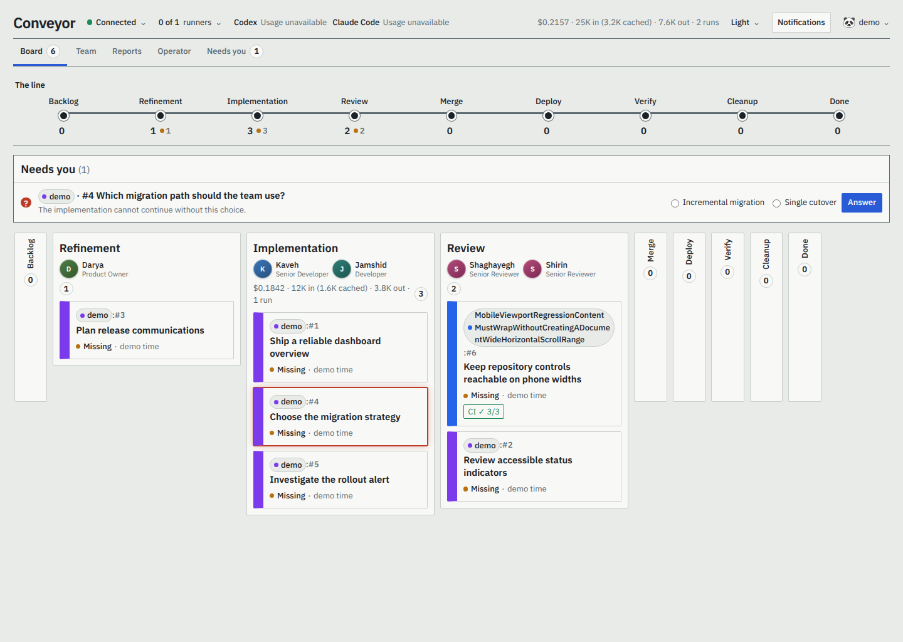
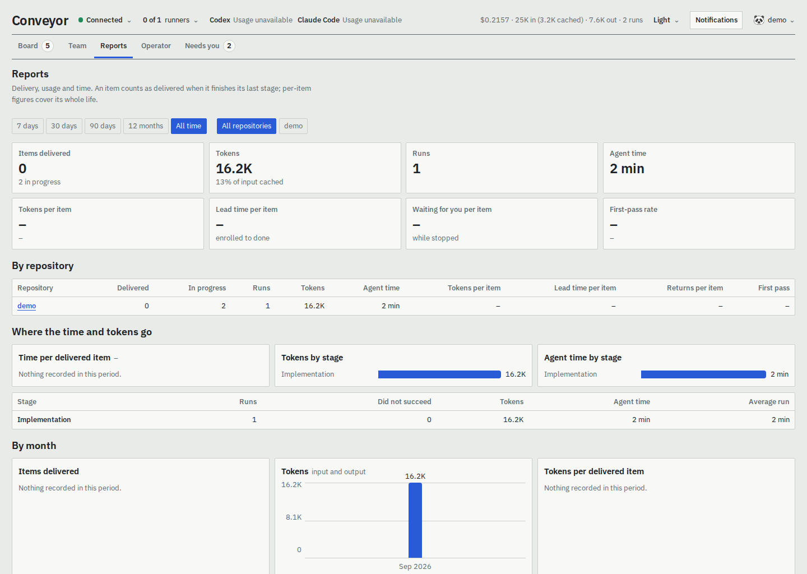
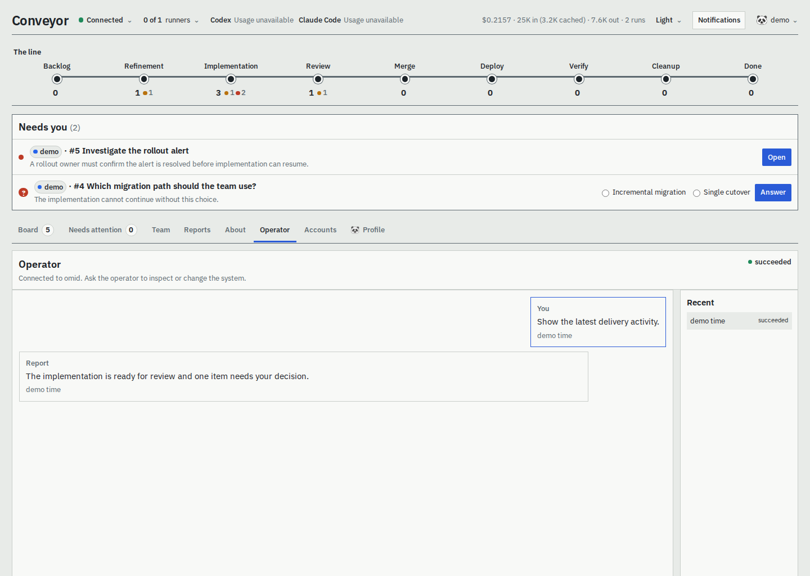
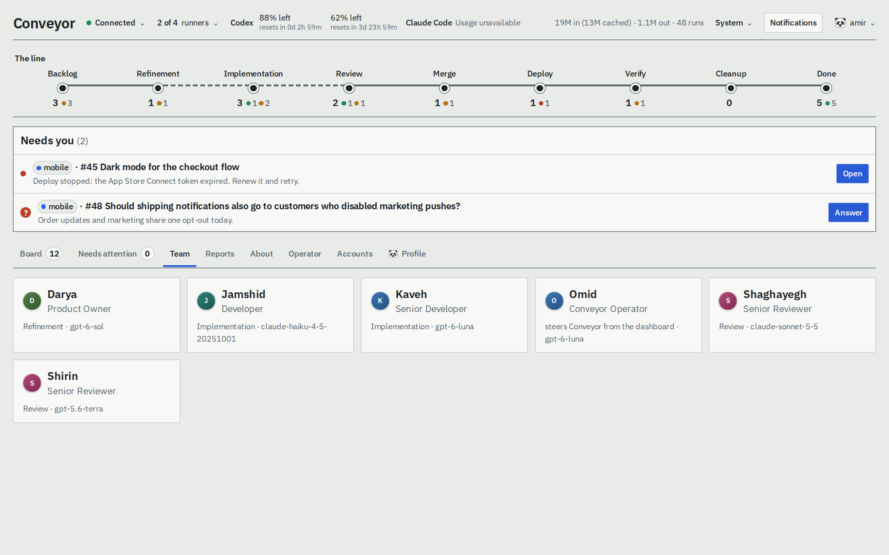

# Conveyor

[](./LICENSE)
[](https://github.com/Abaniumbay/conveyor/actions/workflows/check.yml)
[](https://github.com/Abaniumbay/conveyor/releases)

**Conveyor delivers GitHub issues with AI agents, end to end, on your own server.** Label an issue
and Conveyor takes it through a pipeline you define: an agent refines it into acceptance criteria,
another implements it in an isolated worktree and opens a pull request, a reviewer checks it, and
Conveyor merges, deploys and verifies it. Deterministic gates decide when each stage is done, and
you watch and steer everything from a dashboard or the command line.



## Why Conveyor

- **GitHub stays the source of truth.** Issues, labels, pull requests and checks drive everything.
  Conveyor reconciles from them; it is not a second tracker.
- **Every stage ends in a gate, not an opinion.** A stage is done when code says so: criteria
  checked, findings resolved, CI green, the deploy script succeeded. Each failure says what is
  missing.
- **Agents get least privilege.** Each run sees one issue through a scoped MCP server with an exact
  tool grant, works in its own Git worktree, and can be sandboxed to an allowlisted network.
- **Nothing is lost on a restart.** Every task and its context are journaled in SQLite; a restart
  resumes where it stopped and never repeats an external change.
- **You stay in control.** Questions come to you, stopped items say exactly why and what to do, and
  nothing closes an issue but you.
- **One small thing to run.** A single executable, one SQLite database, a systemd unit. No
  containers, queues or cloud services.

## How it works

```text
issue labelled "conveyor"
   │
   ▼
refinement ──► implementation ──► review ──► merge ──► deploy ──► verify ──► cleanup
  (agent)        (agent, PR, CI)   (agent)              (your scripts)
```

Each stage runs its **actions** (an agent, a script, or a provider step such as pushing or merging)
and then its **exit gate**: checks over the issue, the pull request, CI and script results. A passing
gate moves the issue to the next stage label; a failing one sends it back with the reason, retries
it, or stops it for you. Stages, agents, models and gates are all configuration: the pipeline above
is the packaged default. Read more in [docs/architecture.md](docs/architecture.md).

| Item details and its conversation | Reports |
| --- | --- |
|  |  |
| **The operator: ask Conveyor to inspect or change the board** | **The team: every agent, its model and its tools** |
|  |  |

## Quick start

On a Linux machine (x64 or arm64) with Git, the [GitHub CLI](https://cli.github.com/), bubblewrap,
and both [Codex](https://github.com/openai/codex) and
[Claude Code](https://docs.claude.com/en/docs/claude-code) installed. The packaged default
configuration requires both harness executables for `conveyor doctor` to pass. Sign in to both
before running packaged agents: Codex is required for refinement, while Claude Code is the first
reviewer and the implementation fallback when Codex cannot run.

```sh
curl -fsSLO https://github.com/Abaniumbay/conveyor/releases/latest/download/install.sh
sh install.sh                     # verifies the download; installs into ~/.local/share/conveyor
conveyor init                     # creates ~/.conveyor and your dashboard administrator
```

Add a repository, one file each, pointing at an existing clone:

```yaml
# ~/.conveyor/config/repositories/my-app.yaml
items: github
code: github
ci: { mode: required }
address: me/my-app
folder: ~/code/my-app
pipeline: delivery
agentEgress: { allowLoopbackMcp: true, httpsHosts: [registry.npmjs.org] }
```

Check everything, then start it:

```sh
gh auth login                    # the account Conveyor uses for managed repositories
codex login                      # required by the packaged default for refinement
claude auth login                # required by the packaged default for review and fallback implementation
conveyor doctor                  # checks both configured agent-harness executables and lists any fix
conveyor serve                   # dashboard on http://127.0.0.1:7788
```

If you customize the agent configuration, install every CLI that configuration uses; `conveyor
doctor` checks the harness executables in the loaded configuration. Sign in to each CLI before
running its agents.

Label an issue `conveyor` and watch it move. To run Conveyor as a service:

```sh
sudo ~/.local/bin/conveyor service install --account "$USER"
sudo ~/.local/bin/conveyor service start
```

The full walkthrough, including a private configuration repository, troubleshooting and upgrades, is
[docs/operations.md](docs/operations.md).

## Everyday commands

```sh
conveyor status                    # versions, dashboard URL, health, capacity, stopped items, disk use
conveyor board                     # every item with its stage and state
conveyor item show my-app:42       # where it is, what blocks it, what you can do
conveyor item retry my-app:42      # after fixing what blocked it
conveyor questions list            # questions agents asked you
conveyor logs --follow             # the service log
conveyor upgrade                   # drain, back up, switch, restart, verify
```

Every command takes `--help` and `--json`; see [docs/cli.md](docs/cli.md).

## Documentation

| Guide | What it covers |
| --- | --- |
| [Operations](docs/operations.md) | Installing, the first run, the systemd service, day-to-day work, troubleshooting, upgrades and rollback, several instances |
| [Configuration](docs/configuration.md) | `conveyor.yaml`, `!include` and `!secret`, packaged defaults, pipelines, agents, CI, logging, retention |
| [Command line](docs/cli.md) | Every command and option, and the exit codes |
| [Dashboard](docs/dashboard.md) | The board, item details, agents, reports, the operator, push notifications |
| [Tasks](docs/tasks.md) | Every task a pipeline can use, and the script protocol |
| [Architecture](docs/architecture.md) | Design principles, components, the pipeline model, MCP, reliability, security |
| [Migrating](docs/migration.md) | Moving a source-checkout installation onto a release |
| [Releasing](docs/releasing.md) | Cutting a release (for maintainers) |
| [Specification](SPEC.md) | The complete behavioural contract |

## Development

Conveyor is TypeScript on [Bun](https://bun.sh/) 1.4.

```sh
bun install --frozen-lockfile
bunx playwright install chromium    # once per machine, for dashboard screenshots
bun run check                     # every test and the typecheck
bun run src/cli.ts --help         # the CLI from source
bun run build && bun run smoke    # build the release archive and test it outside the checkout
bun run docs:screenshots          # regenerate dashboard screenshots when layout changes
```

Tests use temporary repositories and databases and need no credentials. Changes are recorded in
[CHANGELOG.md](CHANGELOG.md); releases are cut from tags ([docs/releasing.md](docs/releasing.md)).

After installing dependencies and Playwright Chromium, run `bun run docs:screenshots` from the
repository root to regenerate the dashboard images. When you change the dashboard layout, run that
command and commit the regenerated images (in `docs/screenshots/`) in the same pull request. It
starts Conveyor with isolated demo data and captures each view at a fixed viewport; PR Check runs
it twice and verifies pixel-identical output.

## Status and limits

Conveyor is pre-1.0 and runs on a trusted, single-owner Linux server. It supports GitHub, Codex and
Claude Code agents, sequential pipelines and existing repository clones. It does not provide
multi-tenant isolation, container images, a general workflow engine or automatic issue closure.
See [SPEC.md](SPEC.md) for the full contract.

## License

[MIT](LICENSE)
