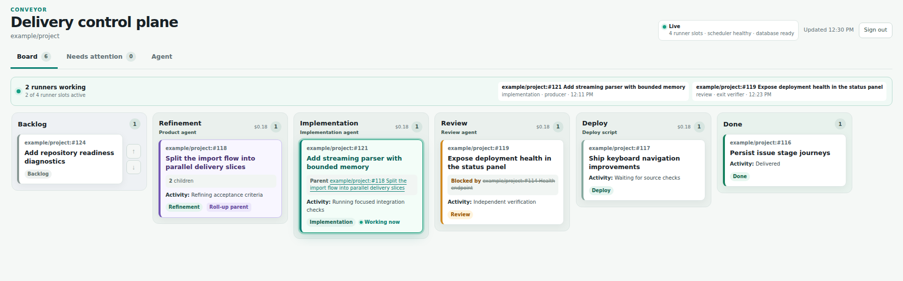
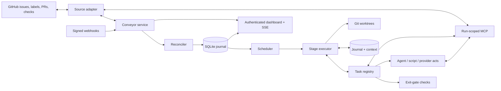
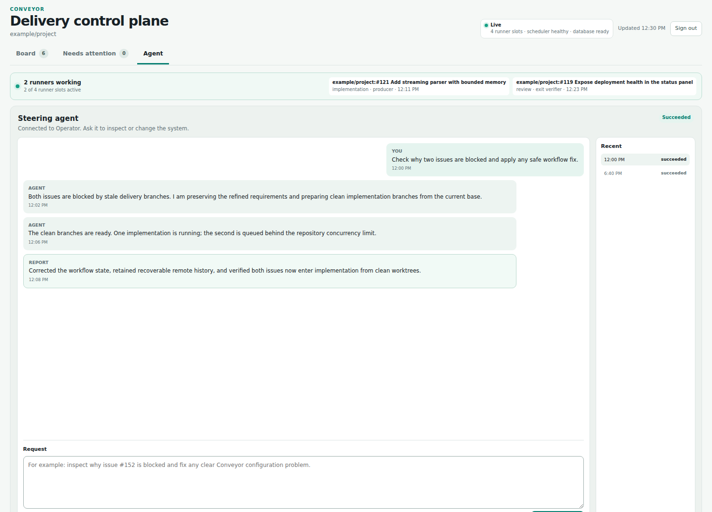

# Conveyor

[](./LICENSE)
[](https://bun.sh/)

Conveyor is a GitHub-native autonomous software delivery orchestrator for a trusted server. Issues remain the source of truth while configurable agents, scripts, and provider actions move work through a delivery pipeline, and deterministic gates decide when each stage is done.

It is deliberately smaller than a general workflow platform: one Bun process, one SQLite database, isolated Git worktrees, scoped MCP tools, and a server-rendered operations dashboard.



## What Conveyor does

Conveyor watches configured GitHub repositories and projects enrolled issues onto a durable delivery board. For each runnable issue it can:

1. create or reuse an isolated feature worktree;
2. run a stage's `actions`: a Codex agent, a repository script, or an idempotent provider action (push, open a pull request, start CI, merge);
3. evaluate the stage's `exit-gate`: deterministic checks over the current issue, workspace, pull request and CI state;
4. open the gate and advance the GitHub stage label, wait (a pending check parks the item and holds no runner), or route a failure back for another attempt, to an earlier stage, or to a stopped state;
5. record every task, its result and the context it saw in a durable journal, so a restart resumes instead of repeating work;
6. run repository-defined deployment and post-deployment verification;
7. retain a concise user conversation separately from technical logs.

Stages have no built-in names or meanings. A pipeline may model refinement, implementation, review, merge, deployment, cleanup, or a completely different sequence.

## Design principles

- **GitHub is authoritative.** Issues, labels, relationships, pull requests, and checks are reconciled from the source rather than replaced by a second issue tracker.
- **Configuration defines behavior.** Stages, agents, checks, concurrency, retry policy, labels, and lifecycle actions live outside managed repositories.
- **Every stage ends in a deterministic gate.** Gates are code over structured evidence (criterion approvals, review findings, CI results, script results), not AI judgement: the same state gives the same answer and every failure says what is missing. Judgement stays in the working agents, and its evidence is recorded for the gate to check. Native stages have no AI verifier.
- **Runs are least-privilege.** Every agent receives a per-run MCP server exposing only its configured tools and issue context.
- **Work is isolated.** Feature changes happen in Git worktrees; Conveyor does not edit a repository's primary checkout.
- **Progress is durable.** SQLite journals runs, attempts, transitions, questions, costs, source mutations, conversation messages, and every task execution with the context it ran against.
- **External mutations are idempotent.** Each act records a planned execution before it changes anything, observes external state first and does only the missing work, so a crash between a side effect and its record is repaired rather than repeated.
- **Humans stay in control.** Conveyor never directly closes an issue. It can mark completed open issues as closable and let GitHub close an issue through an ordinary PR reference.

## Architecture



### Engine components

| Component | Responsibility |
| --- | --- |
| Configuration loader | Recursively loads split YAML, resolves paths relative to their declaring file, rejects duplicate definitions, validates cross-references, and computes a stable configuration hash. |
| GitHub source adapter | Reads issues and relationships, manages only configured labels/body sections, observes pull requests and checks, verifies webhooks, and performs idempotent source actions. |
| Reconciler | Rebuilds the local projection from GitHub, detects enrollment and label drift, and wakes work after webhook or polling changes. |
| Scheduler | Selects eligible issues while enforcing global, repository, and stage concurrency plus parent/dependency constraints. |
| Workspace manager | Creates issue-specific Git worktrees and branches without changing the primary checkout. |
| Task registry | One registry of named tasks in the groups `item`, `workspace`, `change`, `ci`, `agent`, `script`, `conversation`, `todo` (and `legacy`). Each task declares its kind (`load`, `check`, `act`, `tool`), what it reads, writes and invalidates, and its schema. The MCP server, the stage executor and the generated [docs/tasks.md](docs/tasks.md) all read it. |
| Plan compiler | Turns a pipeline, a repository (CI mode, overrides) and the registry into an expanded execution plan, rejecting unknown tasks, duplicate instance ids, invalid dataflow and invalid routes at load time. `check-config` prints the plan. |
| Stage executor | Runs one compiled stage as a durable task chain: implicit loads, journaled acts, the exit gate, waiting, `onFail` routing, retries and the `maxReturns` guard. |
| Execution journal | Persists the item context and its append-only history, each task execution with its idempotency key, the stage cursor, stage epochs (fencing tokens) and persisted wake-ups. |
| Legacy compatibility compiler | Compiles the deprecated `run` / `enterCheck` / `exitCheck` stage shape into a task plan (`legacy.*` tasks) so existing configurations keep working. |
| Harness (Codex, Claude Code) | Starts non-interactive structured agent runs with a chosen model, effort level, sandbox, approvals policy, output schema, scoped MCP configuration and, where the harness advertises it, session resume after a question. Claude Code agents are read-only for now: the process runs in bubblewrap with the filesystem mounted read-only (except its config directory and a private `/tmp`), the service's secrets hidden, no user or project settings, and only the read tools, Bash and the Conveyor MCP tools. |
| JSON-process runner | Executes repository-defined programs that accept JSON on stdin and return exactly one validated JSON result. |
| Scoped MCP server | Serves the registry's `tool` tasks to each live run under an exact grant, through one dispatcher that re-checks the grant and preconditions. Grants expire with the run. |
| Agent isolation | Sanitized agent environment and, per repository, a network namespace with allowlisting proxies (`src/isolation`). |
| SQLite store | Persists source projections, stage state, attempts, events, transitions, questions, costs, artifacts, leases, review findings, criterion approvals, advisory CI watches and idempotency records in WAL mode. |
| Web control plane | Serves an authenticated Preact dashboard, issue conversations, questions, stage history, technical logs, steering runs, health endpoints, and live SSE refresh. |
| Idle deployment helper | Waits for a durable idle boundary before restarting a service and verifies its liveness afterward. |

## Dashboard

The board shows backlog, configured stages, completed work, active runner capacity, dependency/child relationships, warnings, questions, and per-stage usage (tokens in and out, plus the dollar amount when the harness reports one; subscription harnesses do not). Issue dialogs separate four concerns:

- **Summary** — current state, relationships, criteria, labels, token usage (and cost when known), and duration.
- **Conversation** — concise owner and agent handoff messages that survive future runs.
- **Journey** — stage transitions, corrections, stops, and their reasons.
- **Technical logs** — paginated raw run events for debugging.

Above the board, every configured agent links to a read-only profile page (`/agents/<id>`; `/agents` lists them all) showing its harness, model, effort, workspace access, the pipeline stages it works in, its granted tools, and its instructions.

**Reports** (`/reports`, drill into one repository with `/reports/<repository>`, filter with `?period=7d|30d|90d|12m`, all time by default) show delivery, usage and time: items delivered and in progress, runs (and how many did not succeed), tokens and their cached share, agent time, and per delivered item the average tokens, runs, lead time (enrolled to done), returns and first-pass rate. It breaks an item's lead time into agents working, waiting on CI and checks, waiting for you (stopped) and queued, and shows tokens and agent time per stage, per repository and per month. A repository's page lists its items with the same figures, each linking to the item. An item counts as delivered when it finishes its last stage; done items imported without that record are left out and counted in a note.

The optional steering agent is intentionally quieter than the technical log. Only explicit MCP progress and the final report are shown; commands, tool calls, raw output, and private reasoning are not rendered.



## Issue and pipeline model

An issue is enrolled with the configured base label (by default `conveyor`). A stage label such as `conveyor:implementation` projects it into a pipeline stage. State labels represent stopped or terminal conditions, and an order label provides durable backlog ordering.

Removing the enrollment label pauses execution without erasing the issue. Removing every Conveyor-prefixed label offboards it from the dashboard. Ambiguous, unknown, or conflicting labels are shown under **Needs attention** rather than guessed.

Parents are roll-ups: they do not consume runner capacity while children remain. Their source stage and board column follow the earliest pipeline stage occupied by an unfinished child, and the board separates them from executable issues within that column. Dependencies prevent an issue from running until the required issues are satisfied. A refinement stage may create child issues and place them directly into a later stage so independent slices can run in parallel.

Every stage is two task lists:

- **`actions`** do the stage's job: run an agent, run a script, ensure a workspace, push and open a change request, start CI, merge.
- **`exit-gate`** proves it is done and must not be empty: checks that read the loaded context and return `pass`, `pending` or `fail`. Conditions the next stage needs belong to the previous exit gate; there are no entrance gates.

A passing gate advances the item. A `pending` check parks the item (releasing its permits) and the whole gate is re-evaluated with fresh data after the task's poll interval or an earlier webhook; actions are not repeated. A `fail` is routed by `onFail`: `retry` (the default for the gate, bounded by the stage's `retries`; the actions run again with the failure as feedback), `{ return: <stage> }` (for example review findings returning to implementation, bounded by `settings.maxReturns`), or `{ stop: <state> }`. An action that fails stops as `blocked` unless configured otherwise. A thrown error is an infrastructure error with its own bounded retry policy, not a domain failure. The task reference, with the script protocol, is [docs/tasks.md](docs/tasks.md), generated from the registry.

A stage that uses `run`, `enterCheck` and `exitCheck` is the deprecated legacy shape, which still loads (see Configuration).

## Run-scoped MCP

Agents never receive unrestricted control-plane access. Conveyor creates an ephemeral MCP context containing the current issue, repository, workspace, delivery state, source guidance, and an allowlist selected from:

- read tools for the issue, workspace, delivery state, and shared conversation;
- user-facing progress, questions, blockers, milestones, rationale, results, and artifacts;
- constrained label, acceptance-criteria, hierarchy, dependency, comment, and PR metadata changes;
- scoped workspace fetch, push, and artifact operations;
- read-only CI logs and review findings.

Tools are the registry's `tool` tasks, named in camelCase:

- `item.*`: `get`, `comment`, `setCriteria`, `setTitle`, `setSystemLabels`, `setParent`, `setDependencies`, `createChild`, `guidance`
- `workspace.*`: `get`, `fetch`, `push`
- `change.*`: `get`, `setMetadata`, `checkCriterion`, `uncheckCriterion`, `comment`, `resolveFinding`, `listFindings`
- `ci.getLogs`, `conversation.get`
- `todo.*`: `get`, `set`, `update`
- `agent.*`: `askQuestion`, `reportProgress`, `reportRationale`, `reportBlocker`, `reportResult`, `reportMilestone`, `recordArtifact`

`agents.<id>.tasks` is the exact grant (default: every grantable tool); `change.dismissFinding` can never be granted to an agent. The legacy snake_case names remain accepted as aliases in grants (`tools:` is normalised to `tasks`; using both is an error) and in calls:

| Legacy name | Canonical name |
| --- | --- |
| `source.get_issue`, `source.get_guidance`, `source.add_comment` | `item.get`, `item.guidance`, `item.comment` |
| `source.set_acceptance_criteria`, `source.set_system_labels` | `item.setCriteria`, `item.setSystemLabels` |
| `source.set_parent`, `source.set_dependencies`, `source.create_child` | `item.setParent`, `item.setDependencies`, `item.createChild` |
| `source.set_pull_request_metadata`, `delivery.get_state` | `change.setMetadata`, `change.get` |
| `delivery.get_check_logs` | `ci.getLogs` |
| `workspace.get_context`, `workspace.request_fetch`, `workspace.request_push` | `workspace.get`, `workspace.fetch`, `workspace.push` |
| `run.report_*`, `run.ask_question` | `agent.report*`, `agent.askQuestion` |
| `run.record_artifact`, `workspace.record_artifact` | `agent.recordArtifact` |

Review findings are recorded by Conveyor, not by the code host: an agent creates one with `change.comment` (an inline review comment when `path` and `line` are in the diff, otherwise a managed change comment), and `change.load` imports native human review (unresolved threads and changes-requested reviews; ordinary conversation comments are ignored). A finding is `open` until it is resolved (`change.resolveFinding`, or the thread resolved on the host), dismissed by a person, or withdrawn because its native comment was deleted; every change is kept in an audit trail. Agents close every finding themselves, whoever wrote it, so nothing waits for a person: `change.resolveFinding` takes a verdict (`fixed`, or `invalid` when the finding is wrong, does not apply or is already satisfied) and a comment, posts "👍 Fixed in <head> by <agent>: …" or "👎 Not changed by <agent>: …" as a reply with a matching reaction, and resolves the thread; an imported finding is resolved only once its native thread is. The `change.findingsResolved` check fails while any finding is open, and the review gate passing records the `reviewPassed` checkpoint that `change.merge` requires. A reviewer agent that returns `changes-requested` without recording a finding stops with an error. An operator dismisses a finding with `POST /api/issues/:issueId/findings/:findingId/dismiss` (signed-in session, `X-CSRF-Token` header, JSON `{ "reason": "..." }`, reason required); there is no dismiss button in the web UI yet.

Every call goes through one dispatcher in the service that re-checks the grant, validates input, actor and preconditions (an input `headSha` must equal the live change head), and journals mutating calls by run, tool and input so a retried call returns the stored response. Read tools are always live. Source and workspace mutations pass back through the Conveyor service, where scope, idempotency, and branch rules are enforced. In the deprecated legacy shape, verifier agents receive a read/report-only subset even if their agent definition lists mutation tools.

## Reliability and recovery

- SQLite uses durable WAL-backed state and records each stage attempt with the configuration hash that created it.
- The executor persists a cursor (the current list and task instance), each task execution (`planned`, `running`, `pending`, `completed`) and the item context after every task. A restart resumes at the cursor: completed actions are replayed from the journal, never rerun, and a pending task keeps its first-pending time, next wake-up and deadline, so a timeout is not reset.
- Before an act changes anything it records a `planned` execution with an idempotency key derived from the item, stage, stage epoch, attempt and task instance. On resume the act observes external state first and does only the missing work. A `reconcile` script gets an `observe` phase and an `indeterminate` answer stops as `needs-intervention` rather than risking a duplicate effect.
- Every stage, state or enrollment change bumps the item's stage epoch. Every journal and context write is fenced by it, so a late task from a paused, relabelled or returned stage cannot mutate or advance the item.
- A parked item whose stored context carries a different configuration hash restarts its stage from the beginning once, with one conversation note, rather than resuming against a plan that may no longer contain its cursor. Migrate and roll back while the board is idle (see [docs/migration.md](docs/migration.md)).
- The context history is append-only per task and the latest context is bounded by `settings.history.contextSummaryBytes`; large logs stay artifacts.
- Interrupted runs are recovered into schedulable state.
- Infrastructure and usage-limit retries are separate and use configurable bounded backoff.
- Source mutations carry idempotency keys.
- Reconciliation repairs stale projections from GitHub and refuses ambiguous configuration drift.
- Requirement changes do not interrupt an agent run. The exit gate and later review read the latest issue state and send outdated work back.
- Full run activity is retained independently from the concise shared conversation.

## Security boundary

Conveyor is intended for a trusted single-user server, not hostile multi-tenant execution.

- The dashboard uses a scrypt password hash, signed `HttpOnly`/`SameSite=Strict` sessions, and CSRF protection.
- Public deployments should sit behind a TLS reverse proxy; secure cookies are enabled when `web.publicUrl` is HTTPS.
- GitHub webhooks are verified with HMAC-SHA256.
- Internal MCP requests use random bearer grants scoped to one live run and an explicit tool allowlist.
- Agent prompts identify issue content as requirements rather than privileged system instructions.
- Worktree and branch operations are constrained to the run's configured repository and feature branch.
- Secrets, runtime configuration, databases, logs, artifacts, and managed worktrees are deliberately excluded from this repository.

### Agent isolation

Every Codex agent process (task runs, legacy verifier checks and steering) starts from a sanitized environment: `GH_TOKEN`, `GITHUB_TOKEN`, their enterprise variants, `GIT_ASKPASS`, `SSH_AUTH_SOCK`, `GH_CONFIG_DIR`, `GIT_CONFIG_GLOBAL`, every `CONVEYOR_*` variable and anything named like a token, secret, password or API key are removed. `HOME` points at a per-run home under the run's artifacts directory (`<artifacts>/<runId>/home`) that holds only a `.gitconfig` with the repository's `user.name` and `user.email`. Codex keeps authenticating through `CODEX_HOME`, which stays pointed at the real `~/.codex`.

A repository may declare `agentEgress` (`allowLoopbackMcp`, default `true`, and `httpsHosts`, default `[]`): exact lowercase DNS names only, with no wildcards, IP literals, CIDRs, ports, schemes, trailing dots or duplicates, and never `api.github.com` or `uploads.github.com`. **Repositories that declare the block are network-sandboxed; repositories without one keep the sanitized environment only (legacy behaviour, until their config is migrated).** Enforcement needs `bwrap` (bubblewrap) and uses no other native dependency:

- Each agent run (every `agent.run`, and legacy verifier checks) executes Codex under `bwrap --unshare-net --unshare-pid` (the sandbox dies with its wrapper). `/tmp`, `/run/user/<uid>` and the Docker socket are masked; other host path-based Unix sockets remain reachable, so keep sensitive sockets out of the operator account (see SPEC, Agent network egress). The namespace has only a loopback, so there is no route out; a bridge inside it forwards loopback ports to per-run Unix sockets under `<artifacts>/<runId>/net/`.
- Commands the agent runs get `HTTPS_PROXY`/`HTTP_PROXY`/`ALL_PROXY`/`npm_config_*proxy` pointing at the data-plane proxy, which tunnels only `CONNECT <host>:443` for hosts in `httpsHosts`. IP literals are refused, DNS is resolved by the proxy, and loopback, private, link-local, CGNAT and unique-local answers are refused. Every CONNECT (so every redirect hop) is checked independently.
- Codex itself talks to its model backend through a second proxy that requires a per-run random token and allows only the runner's `controlPlaneHosts` (default `chatgpt.com`, `api.openai.com`, `auth.openai.com`; configurable on the `codex` runner). The token is removed from commands Codex runs through `shell_environment_policy` overrides.
- With `allowLoopbackMcp`, the exact web port is forwarded inside the namespace to a Unix socket (`<artifacts>/mcp.sock`) served by the service that exposes only `/internal/mcp`; no other loopback service is reachable.

Operator check (real network, not part of `bun test`): `bun scripts/check-agent-egress.ts <repository-id> --config <dir>` clones the repository, runs its restore (`npm ci`, `flutter pub get`, `dotnet restore`, `./gradlew help`, `pip download`) inside the sandbox with an empty cache, requires `api.github.com` and direct IP connections to fail, and lists every host the proxy refused so the allowlist can be completed.

## Requirements

- Linux or another environment supported by Bun
- [Bun](https://bun.sh/) 1.4 or newer
- Git
- [GitHub CLI](https://cli.github.com/) authenticated for configured repositories
- Codex CLI for Codex-backed agents
- Existing local clones of managed repositories; v0.1 does not clone them automatically

## Install and verify

```sh
git clone https://github.com/Abaniumbay/conveyor.git
cd conveyor
bun install --frozen-lockfile
bun run check
```

Keep configuration and agent instructions outside the source checkout. A common layout is:

```text
/srv/conveyor/
├── config/
│   ├── core.yaml
│   ├── agents.yaml
│   ├── pipelines.yaml
│   ├── repositories.yaml
│   └── instructions/
└── state/
    ├── conveyor.sqlite
    ├── logs/
    ├── artifacts/
    └── worktrees/
```

Configuration can be one YAML file or a directory of YAML files. Named sections merge by unique key; singleton sections such as `settings`, `web`, and `labels` may be declared only once.

The canonical shape names the three provider roles, the harnesses, and gives every stage `actions` and an `exit-gate`. This is the shape of the reference configuration in [`examples/config`](examples/config) (see [docs/tasks.md](docs/tasks.md) for every task and `docs/migration.md` for adopting it):

```yaml
settings:
  runners: 4
  database: /srv/conveyor/state/conveyor.sqlite
  logs: /srv/conveyor/state/logs
  workspaces: /srv/conveyor/state/worktrees
  artifacts: /srv/conveyor/state/artifacts
  reconcileInterval: 5m
  maxReturns: 5
  agentRunTokenWarning: 15000000   # warn (never stop) when one agent run uses more input tokens
  history:
    contextSummaryBytes: 65536
  retries:
    infrastructureAttempts: 5
    usageLimitAttempts: unlimited
    minBackoff: 30s
    maxBackoff: 30m
  taskDefaults:
    wait: { timeout: 30m, poll: 1m }

web:
  listen: 127.0.0.1:4300

providers:
  items:
    github:
      type: github
      webhookPath: /hooks/github
      autoConfigureWebhook: false
      labels:
        enrollment: conveyor
        stageTemplate: "conveyor:{stage}"
        states:
          done: conveyor:done
          blocked: conveyor:blocked
          rejected: conveyor:rejected
          error: conveyor:error
          needs-input: conveyor:needs-input
          needs-intervention: conveyor:needs-intervention
        metadata:
          closable: conveyor:closable
          orderTemplate: "conveyor:order:{number}"
  code:
    github: { type: github }
  ci:
    actions: { type: github-actions }

harnesses:
  codex:
    type: codex
    command: codex
    sandbox: workspace-write
    automaticApprovals: true
  claude-code:
    type: claude-code
    command: claude          # configDir: defaults to ~/.claude, the service user's login
  process:
    type: json-process

agents:
  refiner:
    name: Refiner
    title: Product Owner
    harness: codex
    effort: high
    instructions: ./instructions/refiner.md
    access: read-only
    tasks: [item.get, item.guidance, workspace.get, conversation.get, agent.reportProgress,
            agent.askQuestion, item.comment, item.setCriteria, item.setTitle, item.setSystemLabels,
            item.setParent, item.setDependencies, item.createChild]
  implementer:
    name: Implementer
    title: Software Engineer
    harness: codex
    effort: high
    instructions: ./instructions/implementer.md
    access: workspace-write
    network: true                     # web search, and network for installs and builds
    writableRoots: [~/.bun/install/cache, ~/.npm]   # package caches; missing ones are skipped
    codexConfig: { model_auto_compact_token_limit: 80000 }   # extra Codex settings (-c key=value)
    mcpServers:                       # tools beside Conveyor's own, e.g. a code index
      serena:
        command: serena
        args: [start-mcp-server, --project, "{workspace}", --context=codex]
        env: { SERENA_HOME: ~/.serena }
        startupTimeoutSec: 60
        enabledTools: [find_symbol, find_referencing_symbols, get_symbols_overview]  # it runs outside the sandbox
        gitExclude: [.serena/]         # files it writes in the worktree; never committed
    tasks: [item.get, item.guidance, workspace.get, change.get, ci.getLogs, conversation.get,
            agent.reportProgress, agent.askQuestion, workspace.fetch, workspace.push,
            change.listFindings, change.comment, change.resolveFinding]
  reviewer:
    name: Reviewer
    title: Senior Reviewer
    harness: codex
    effort: high
    instructions: ./instructions/reviewer.md
    access: read-only
    tasks: [item.get, workspace.get, change.get, ci.getLogs, conversation.get, agent.reportProgress,
            change.listFindings, change.comment, change.resolveFinding,
            change.checkCriterion, change.uncheckCriterion]

pipelines:
  default:
    stages:
      - id: refinement
        concurrency: 3
        retries: 2
        childrenStartAt: next
        actions:
          - { id: refine, task: agent.run, with: { agent: refiner } }
        exit-gate:
          - { id: criteria, task: item.criteriaDefined }
          - { id: labels, task: item.labelsValid }
          - { id: children, task: item.childrenValid }
          - id: dependencies
            task: item.dependenciesMet
            wait: { timeout: unlimited, poll: 5m }
      - id: implementation
        concurrency: 2
        retries: 3
        actions:
          - { id: workspace, task: workspace.ensure }
          - { id: implement, task: agent.run, with: { agent: implementer } }
          - { id: ensureChange, task: change.ensure, with: { closingReference: true, criteriaChecklist: true } }
          - { id: startCi, task: ci.start, when: ci.enabled }
        exit-gate:
          - { id: pushed, task: workspace.pushed }
          - { id: criteriaSynced, task: change.criteriaInSync }
          - { id: ciDefined, task: ci.defined, when: ci.required, onFail: { stop: blocked } }
          - { id: ciGate, task: ci.passed, when: ci.required, wait: { timeout: 3h, poll: 1m } }
      - id: review
        concurrency: 1
        actions:
          - { id: review, task: agent.run, with: { agent: reviewer } }   # or agents: [first, backup]
        exit-gate:
          - { id: findings, task: change.findingsResolved, onFail: { return: implementation } }
          - { id: criteriaApproved, task: change.criteriaChecked, onFail: { return: implementation } }
          - { id: ciHead, task: change.headUnchanged, when: ci.required, onFail: { return: implementation } }
          - { id: mergeable, task: change.mergeable, wait: { timeout: 30m, poll: 1m }, onFail: { return: implementation } }
      - id: merge
        concurrency: 1
        actions:
          - { id: mergeReviewedHead, task: change.merge, with: { method: squash } }
        exit-gate:
          - { id: merged, task: change.merged, onFail: { return: implementation } }
      - id: deploy
        concurrency: 1
        actions:
          - { id: deployScript, task: script.run, with: { script: ./stages/deploy.ts, recovery: reconcile } }
        exit-gate:
          - { id: deployed, task: script.succeeded, with: { run: deployScript }, onFail: { stop: needs-intervention } }

repositories:
  example:
    items: github
    code: github
    ci: { provider: actions, mode: required, ignoreChecks: [] }   # required | advisory | disabled
    address: example/project
    folder: /srv/repositories/project
    baseBranch: main
    pipeline: default
    concurrency: 2
    agentEgress:
      allowLoopbackMcp: true
      httpsHosts: [registry.npmjs.org]
    overrides:
      stages:
        deploy:
          actions:
            deployScript: { with: { script: /srv/conveyor/stages/deploy-example.ts, recovery: reconcile } }
```

Task entries take `id`, `task`, `with`, `wait`, `onFail` and `when`. `id` defaults to the task name when it occurs once in the list and is required for duplicates; overrides, execution records, script results and idempotency keys use the instance id. `when` is a guard from a closed vocabulary (`ci.enabled`, `ci.required`, `ci.advisory`) evaluated at load time from the repository's CI mode; there are no expressions, variables or loops. `wait` is `{ timeout, poll }` (`timeout: unlimited` never expires; the default comes from the task, else `settings.taskDefaults.wait`). A repository changes a task without copying the pipeline through `overrides.stages.<stage>.<actions|exit-gate>.<instance id>` (`with`, `wait`, `onFail`); naming something that does not exist is an error. `settings.maxReturns` (default 5) bounds `return` loops between stages. `agent.run` takes `agent: <id>` or `agents: [<id>, ...]` in order of preference: when an agent's harness cannot run (a usage limit, a login failure, a crash), the next one takes the same step and the item's conversation says so; a result the agent returned, of any status, is never retried on another agent. An answered question goes back to the agent that asked it first.

Agents list their exact grants in `tasks:`. Verifier agents and the `checks:` section are not part of the native shape.

### Legacy configuration (deprecated, still supported)

Existing configurations keep loading. A stage with `run: { agent | runner + script | sourceAction }`, `enterCheck`, `exitCheck`, `feedbackCycles`, `failurePolicies`, `failureState` and `afterSuccess`, together with the `checks:` section (a deterministic script plus an AI verifier agent), `sources`, `codeHosts`, `runners`, `workspaceAccess` and a top-level `labels`, is compiled by the compatibility compiler into a task plan (`legacy.produce`, `legacy.enterCheck`, `legacy.exitCheck`, `legacy.afterSuccess`, `legacy.succeeded`) with the same behaviour as before and runs through the same durable executor. A legacy stage cannot be mixed with `actions` / `exit-gate` in one stage, and a pipeline with legacy stages still needs `successStatuses` and `failureStatuses`. Legacy `process` stage scripts have no recovery mode, so they stay behind the legacy adapter until each is classified `replay-safe` or `reconcile`. The legacy shape and the AI verifier will be removed once every repository is migrated; do not write new configuration in it.

### Canonical role names and pinned imports

An agent's `network: true` turns on live web search. For a `workspace-write` agent it also gives the agent's own commands the network, so it can install dependencies and run the repository's checks before pushing. Codex's `read-only` mode has no network for commands, so a read-only agent gets web search only. A `workspace-write` agent can always write its worktree's git metadata, which a linked worktree keeps under the main repository's `.git`, outside the sandbox. `writableRoots` (absolute or `~/` paths) adds directories outside the worktree, typically package caches; the ones that do not exist on the machine are skipped.

A Claude Code agent runs inside bubblewrap with the whole filesystem read-only, the service's secrets hidden and `/dev/null` over the Docker and session-bus sockets. With `access: workspace-write` it also gets writable binds for its worktree, the worktree's git metadata and its `writableRoots`, plus the Edit and Write tools in `acceptEdits` mode, which accepts edits inside the worktree and refuses the rest; such an agent needs `network: true`, because the Claude CLI's own API calls need the network, so its commands cannot be kept off it. `network: true` also gives a Claude Code agent WebFetch and WebSearch.

`codexConfig` passes extra Codex settings as `-c key=value`, for example `model_auto_compact_token_limit` to compact a long session's context before it grows expensive. Keys Conveyor derives from the agent's other fields (`sandbox_mode`, `sandbox_workspace_write.*`, `mcp_servers.*`, `model_reasoning_effort`, `web_search`, `approvals_reviewer`) are refused. `mcpServers` gives the agent MCP servers beside Conveyor's own, such as a code index that answers symbol and reference queries instead of whole-file reads. `{workspace}` in a server's `args` becomes the run's worktree, `~/` in `env` values is expanded, and the servers are optional: one that fails to start does not fail the run. A server runs outside the agent's sandbox, so `enabledTools` should limit it to what the agent's access allows; for a read-only agent, lookups only. `gitExclude` lists files the server writes inside the worktree; Conveyor adds them to the repository's local git exclude before the agent runs, so they are never committed and never make a deploy see uncommitted changes. `codexConfig` is Codex-only; `mcpServers` works on Codex and Claude Code (whose allowed tools become `mcp__<server>__<tool>`).

The canonical configuration names the three provider roles and the harnesses: `providers.items` (issue trackers), `providers.code`, `providers.ci`, `harnesses`, agent `harness` and `access`, and repository `items` and `code`. The loader translates them to the older names (`sources`, `codeHosts`, `ci`, `runners`, `runner`, `workspaceAccess`, `source`, `codeHost`), which keep working. `labels` may sit on the item providers (all of them must carry an identical block, which a YAML alias gives you) or at the top level. Using the old and the new name for the same thing is an error, and equivalent documents produce the same configuration hash.

One local file may import reference configuration from a git repository at a fixed ref:

```yaml
import:
  repository: /srv/conveyor-reference   # absolute path to a git checkout
  ref: v1.4.0                           # tag or commit; resolved to a SHA
  path: examples/config                 # directory inside the repository
```

The loader reads that directory at the ref with `git ls-tree` and `git show`, never from the working tree, and merges its YAML files before the local ones. Local files add repositories, settings and secrets but cannot redefine an imported pipeline, agent, provider or harness, and a singleton section (`settings`, `web`, `labels`) may come from one side only. Relative paths in imported files (instructions, scripts) resolve against a copy of the directory written to `<settings.artifacts>/config-imports/<sha>/<path>/`, so `settings.artifacts` must be defined in a local file. The resolved SHA is part of the configuration hash.

### CI providers

CI is a role of its own. Select a named provider and a mode on a repository, or write `ci: <provider>` (mode `required`) or omit it to use the source's native CI provider (GitHub Actions for GitHub):

```yaml
providers:
  ci:
    actions:
      type: github-actions
      triggers:
      - label: run-web-e2e
        workflow: web-e2e.yml
        check: Headless Chrome smoke test
      - label: run-android-e2e
        workflow: android-e2e.yml
        check: Android emulator smoke
      - label: run-full-suite
        workflow: full-suite.yml
        check: Full suite
        replaces: [run-web-e2e, run-android-e2e]

repositories:
  example:
    ci: { provider: actions, mode: required, ignoreChecks: [Optional lint] }
```

`mode` is one of:

- **`required`** (the default): the implementation stage starts CI (`ci.start`) and its exit gate requires `ci.defined` (a missing or unprovable CI definition stops as `blocked`; it never passes silently) and `ci.passed` for every reported check of the current head except `ignoreChecks`. A red run returns to the implementation actions with the focused log; a cancelled run is rerun once; checks that have not registered are awaited for the settle window. The review gate also requires the head to be unchanged since CI passed (`change.headUnchanged`), and merge refuses a head other than the one CI passed for.
- **`advisory`**: only `ci.start` runs; the stage advances without waiting. CI start is announced once, and a durable watch per (repository, item, head commit) is polled by the service outside the stage, without a runner permit. It reports one final pass, failure with focused logs, or timeout (default 3 hours) to the item's conversation, survives a restart, is superseded by a newer head (whose older result is never posted), and never routes, stops or reopens the item.
- **`disabled`**: tasks guarded by `ci.enabled`, `ci.required` or `ci.advisory` are left out of the plan and no CI provider is needed.

Timing is task configuration (`ci.passed` `with: { settleSeconds, logLines }` and `wait`, overridable per repository by instance id). Legacy pipelines keep the `ci.await` source action (`with: { settleSeconds, pollSeconds, timeoutMinutes }`) and `pullRequest.awaitChecks` with `with.triggers`; both are deprecated, and a stage cannot define triggers when its selected provider already declares them.

Validate before starting:

```sh
bun run src/cli.ts check-config --config /srv/conveyor/config
bun run src/cli.ts hash-password --password 'choose-a-strong-password'
```

`check-config` prints the configuration hash and then, for every repository that compiles, the expanded plan of each stage: the `actions` and `exit-gate` task instances in order with their implicit loads (`(load item)`, `(load change)`...), `with` values, `wait` timeout and poll and the effective `onFail` (marked `(default)` when not configured). Legacy stages appear as their `legacy.*` tasks. An invalid task, instance id, route or dataflow is reported with its path before the service can start.

To compare two configurations (for example the current files with the reference configuration in `examples/config`), print their compiled plans side by side with a summary of added, removed and changed tasks, routes and waits. See [docs/migration.md](docs/migration.md).

```sh
bun run src/cli.ts check-config --config /srv/conveyor/config --compare /path/to/other/config
```

Set the runtime environment through your service manager or secret store:

```text
CONVEYOR_USERNAME
CONVEYOR_PASSWORD_HASH
CONVEYOR_SESSION_SECRET
CONVEYOR_GITHUB_WEBHOOK_SECRET   # required only when webhook installation is enabled
```

Then run:

```sh
bun run src/cli.ts serve --config /srv/conveyor/config
```

`GET /health/live` is public for process supervision. Readiness, operational data, and the dashboard require authentication.

## Repository map

```text
src/
├── app/          service orchestration, issue execution, and configured stage runtime
├── codehost/     code-host contract and GitHub implementation (changes, review, merge)
├── config/       YAML loading, role-name normalization, pinned import, hashing, and validation
├── core/         issue projection, scheduling, and transitions
├── db/           SQLite migrations and durable store
├── engine/       stage executor, execution journal, review records, advisory CI watches
├── harness/      neutral agent-harness contract and the Codex harness
├── isolation/    agent environment, network sandbox, egress proxies
├── mcp/          run-scoped MCP context and stdio server
├── runner/       Codex, legacy verifier, steering, and strict JSON-process runners
├── source/       source contracts and the GitHub adapter
├── tasks/        task contract, registry, groups, plan compiler, legacy compiler
├── web/          authentication, HTTP/SSE server, Preact rendering, styles, and client script
└── workspace/    managed Git worktree lifecycle
examples/         reference configuration (config/, imported and pinned) and machine-local samples (local/)
docs/             generated task reference (tasks.md) and the migration guide
scripts/          operational helpers and the task-docs generator
tests/            unit and integration coverage for every engine boundary
SPEC.md           detailed product and engineering contract
```

## Development

```sh
bun install --frozen-lockfile
bun test
bun run typecheck
bun run check
```

Tests use temporary repositories and databases. They do not require real repository addresses or credentials.

## Current limits

Version 0.1 supports GitHub, Codex, one trusted dashboard user, sequential configured pipelines, and existing local repository clones. It does not provide multi-tenant isolation, built-in rollback, a general DAG engine, automatic issue closure, or configuration hot reload. Agent network isolation needs `bwrap` and is enabled per repository. See [SPEC.md](./SPEC.md) for the complete behavioral contract and explicit product boundary.

## License

Conveyor is released under the [MIT License](./LICENSE).
