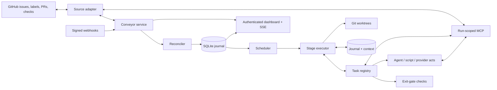

# Architecture

How Conveyor is built and why it behaves as it does. For using it, start with the [README](../README.md) and [operations.md](operations.md).

## Design principles

- **GitHub is authoritative.** Issues, labels, relationships, pull requests, and checks are reconciled from the source rather than replaced by a second issue tracker.
- **Configuration defines behavior.** Stages, agents, checks, concurrency, retry policy, labels, and lifecycle actions live outside managed repositories.
- **Every stage ends in a deterministic gate.** Gates are code over structured evidence (criterion approvals, review findings, CI results, script results), not AI judgement: the same state gives the same answer and every failure says what is missing. Judgement stays in the working agents, and its evidence is recorded for the gate to check. Native stages have no AI verifier.
- **Runs are least-privilege.** Every agent receives a per-run MCP server exposing only its configured tools and issue context.
- **Work is isolated.** Feature changes happen in Git worktrees; Conveyor does not edit a repository's primary checkout.
- **Progress is durable.** SQLite journals runs, attempts, transitions, questions, costs, source mutations, conversation messages, and every task execution with the context it ran against.
- **External mutations are idempotent.** Each act records a planned execution before it changes anything, observes external state first and does only the missing work, so a crash between a side effect and its record is repaired rather than repeated.
- **Humans stay in control.** Conveyor never directly closes an issue. It can mark completed open issues as closable and let GitHub close an issue through an ordinary PR reference.

## Components



### Engine components

| Component | Responsibility |
| --- | --- |
| Configuration loader | Composes the `conveyor.yaml` entrypoint and the files its `!include` / `!secret` tags name, resolves paths relative to the file that declares them, validates cross-references with file-and-key-path errors, and computes a stable configuration hash. |
| GitHub source adapter | Reads issues and relationships, manages only configured labels/body sections, observes pull requests and checks, verifies webhooks, and performs idempotent source actions. |
| Reconciler | Rebuilds the local projection from GitHub, detects enrollment and label drift, and wakes work after webhook or polling changes. |
| Scheduler | Selects eligible issues while enforcing global, repository, and stage concurrency plus parent/dependency constraints. |
| Workspace manager | Creates issue-specific Git worktrees and branches without changing the primary checkout. |
| Task registry | One registry of named tasks in the groups `item`, `workspace`, `change`, `ci`, `agent`, `script`, `conversation`, `todo` (and `legacy`). Each task declares its kind (`load`, `check`, `act`, `tool`), what it reads, writes and invalidates, and its schema. The MCP server, the stage executor and the generated [tasks.md](tasks.md) all read it. |
| Plan compiler | Turns a pipeline, a repository (CI mode, overrides) and the registry into an expanded execution plan, rejecting unknown tasks, duplicate instance ids, invalid dataflow and invalid routes at load time. `conveyor config check` prints the plan. |
| Stage executor | Runs one compiled stage as a durable task chain: implicit loads, journaled acts, the exit gate, waiting, `onFail` routing, retries and the `maxReturns` guard. |
| Execution journal | Persists the item context and its append-only history, each task execution with its idempotency key, the stage cursor, stage epochs (fencing tokens) and persisted wake-ups. |
| Legacy compatibility compiler | Compiles the deprecated `run` / `enterCheck` / `exitCheck` stage shape into a task plan (`legacy.*` tasks) so existing configurations keep working. |
| Harness (Codex, Claude Code) | Starts non-interactive structured agent runs with a chosen model, effort level, sandbox, approvals policy, output schema, scoped MCP configuration and, where the harness advertises it, session resume after a question. Claude Code agents are read-only for now: the process runs in bubblewrap with the filesystem mounted read-only (except its config directory and a private `/tmp`), the service's secrets hidden, no user or project settings, and only the read tools, Bash and the Conveyor MCP tools. |
| JSON-process runner | Executes repository-defined programs that accept JSON on stdin and return exactly one validated JSON result. |
| Scoped MCP server | Serves the registry's `tool` tasks to each live run under an exact grant, through one dispatcher that re-checks the grant and preconditions. Grants expire with the run. |
| Agent isolation | Sanitized agent environment and, per repository, a network namespace with allowlisting proxies (`src/isolation`). |
| SQLite store | Persists source projections, stage state, attempts, events, transitions, questions, costs, artifacts, leases, review findings, criterion approvals, advisory CI watches and idempotency records in WAL mode. |
| Web control plane | Serves an authenticated Preact dashboard, issue conversations, questions, stage history, technical logs, steering runs, health endpoints, and live SSE refresh. |
| Control interface and releases | Serves the CLI over a private Unix socket with the same operations as the dashboard; drains, backs up, switches the installed release and restarts under systemd for upgrades and rollbacks (`src/control`). |
| Service logging | Structured, redacted service logs on stdout/stderr and in a rotated JSON-lines file (`src/log`). |

## Issue and pipeline model

An issue is enrolled with the configured base label (by default `conveyor`). A stage label such as `conveyor:implementation` projects it into a pipeline stage. State labels represent stopped or terminal conditions, and an order label provides durable backlog ordering.

Removing the enrollment label pauses execution without erasing the issue. Removing every Conveyor-prefixed label offboards it from the dashboard. Ambiguous, unknown, or conflicting labels are shown under **Label problems** rather than guessed.

Parents are roll-ups: they do not consume runner capacity while children remain. Their source stage and board column follow the earliest pipeline stage occupied by an unfinished child, and the board separates them from executable issues within that column. Dependencies prevent an issue from running until the required issues are satisfied. A refinement stage may create child issues and place them directly into a later stage so independent slices can run in parallel.

Every stage is two task lists:

- **`actions`** do the stage's job: run an agent, run a script, ensure a workspace, push and open a change request, start CI, merge.
- **`exit-gate`** proves it is done and must not be empty: checks that read the loaded context and return `pass`, `pending` or `fail`. Conditions the next stage needs belong to the previous exit gate; there are no entrance gates.

A passing gate advances the item. A `pending` check parks the item (releasing its permits) and the whole gate is re-evaluated with fresh data after the task's poll interval or an earlier webhook; actions are not repeated. A `fail` is routed by `onFail`: `retry` (the default for the gate, bounded by the stage's `retries`; the actions run again with the failure as feedback), `{ return: <stage> }` (for example review findings returning to implementation, bounded by `settings.maxReturns`), or `{ stop: <state> }`. An action that fails stops as `blocked` unless configured otherwise. A thrown error is an infrastructure error with its own bounded retry policy, not a domain failure. The task reference, with the script protocol, is [tasks.md](tasks.md), generated from the registry.

A stage that uses `run`, `enterCheck` and `exitCheck` is the deprecated legacy shape, which still loads (see [the configuration reference](configuration.md#legacy-configuration-deprecated-still-supported)).

## Run-scoped MCP

Agents never receive unrestricted control-plane access. Conveyor creates an ephemeral MCP context containing the current issue, repository, workspace, delivery state, source guidance, and an allowlist selected from:

- read tools for the issue, workspace, delivery state, and shared conversation;
- user-facing progress, questions, blockers, milestones, rationale, results, and artifacts;
- constrained label, acceptance-criteria, hierarchy, dependency, comment, and PR metadata changes;
- scoped workspace fetch, push, and artifact operations;
- read-only CI logs and review findings.

Tools are the registry's `tool` tasks, named in camelCase:

- `item.*`: `get`, `comment`, `setCriteria`, `setTitle`, `setSystemLabels`, `setType`, `setFields`, `setRefinement`, `setParent`, `setDependencies`, `createChild`, `guidance`
- `workspace.*`: `get`, `fetch`, `push`
- `change.*`: `get`, `setMetadata`, `checkCriterion`, `uncheckCriterion`, `comment`, `resolveFinding`, `listFindings`
- `ci.getLogs`, `conversation.get`
- `todo.*`: `get`, `set`, `update`
- `agent.*`: `askQuestion`, `reportProgress`, `reportRationale`, `reportBlocker`, `reportResult`, `reportMilestone`, `recordArtifact`

`agents.<id>.tasks` is the exact grant (default: every grantable tool); `change.dismissFinding` can never be granted to an agent. The legacy snake_case names remain accepted as aliases in grants (`tools:` is normalised to `tasks`; using both is an error) and in calls:

| Legacy name | Canonical name |
| --- | --- |
| `source.get_issue`, `source.get_guidance`, `source.add_comment` | `item.get`, `item.guidance`, `item.comment` |
| `source.set_acceptance_criteria`, `source.set_system_labels` | `item.setCriteria`, `item.setSystemLabels` |
| `source.set_parent`, `source.set_dependencies`, `source.create_child` | `item.setParent`, `item.setDependencies`, `item.createChild` |
| `source.set_pull_request_metadata`, `delivery.get_state` | `change.setMetadata`, `change.get` |
| `delivery.get_check_logs` | `ci.getLogs` |
| `workspace.get_context`, `workspace.request_fetch`, `workspace.request_push` | `workspace.get`, `workspace.fetch`, `workspace.push` |
| `run.report_*`, `run.ask_question` | `agent.report*`, `agent.askQuestion` |
| `run.record_artifact`, `workspace.record_artifact` | `agent.recordArtifact` |

Review findings are recorded by Conveyor, not by the code host: an agent creates one with `change.comment` (an inline review comment when `path` and `line` are in the diff, otherwise a managed change comment), and `change.load` imports native human review (unresolved threads and changes-requested reviews; ordinary conversation comments are ignored). A finding is `open` until it is resolved (`change.resolveFinding`, or the thread resolved on the host), dismissed by a person, or withdrawn because its native comment was deleted; every change is kept in an audit trail. Agents close every finding themselves, whoever wrote it, so nothing waits for a person: `change.resolveFinding` takes a verdict (`fixed`, or `invalid` when the finding is wrong, does not apply or is already satisfied) and a comment, posts "👍 Fixed in <head> by <agent>: …" or "👎 Not changed by <agent>: …" as a reply with a matching reaction, and resolves the thread; an imported finding is resolved only once its native thread is. The `change.findingsResolved` check fails while any finding is open, and the review gate passing records the `reviewPassed` checkpoint that `change.merge` requires. A reviewer agent that returns `changes-requested` without recording a finding stops with an error. An operator dismisses a finding with `POST /api/issues/:issueId/findings/:findingId/dismiss` (signed-in session, `X-CSRF-Token` header, JSON `{ "reason": "..." }`, reason required); there is no dismiss button in the web UI yet.

Every call goes through one dispatcher in the service that re-checks the grant, validates input, actor and preconditions (an input `headSha` must equal the live change head), and journals mutating calls by run, tool and input so a retried call returns the stored response. Read tools are always live. Source and workspace mutations pass back through the Conveyor service, where scope, idempotency, and branch rules are enforced. In the deprecated legacy shape, verifier agents receive a read/report-only subset even if their agent definition lists mutation tools.

## Reliability and recovery

- SQLite uses durable WAL-backed state and records each stage attempt with the configuration hash that created it.
- The executor persists a cursor (the current list and task instance), each task execution (`planned`, `running`, `pending`, `completed`) and the item context after every task. A restart resumes at the cursor: completed actions are replayed from the journal, never rerun, and a pending task keeps its first-pending time, next wake-up and deadline, so a timeout is not reset.
- Before an act changes anything it records a `planned` execution with an idempotency key derived from the item, stage, stage epoch, attempt and task instance. On resume the act observes external state first and does only the missing work. A `reconcile` script gets an `observe` phase and an `indeterminate` answer stops as `needs-intervention` rather than risking a duplicate effect.
- Every stage, state or enrollment change bumps the item's stage epoch. Every journal and context write is fenced by it, so a late task from a paused, relabelled or returned stage cannot mutate or advance the item.
- A parked item whose stored context carries a different configuration hash restarts its stage from the beginning once, with one conversation note, rather than resuming against a plan that may no longer contain its cursor. Migrate and roll back while the board is idle (see [migration.md](migration.md)).
- The context history is append-only per task and the latest context is bounded by `settings.history.contextSummaryBytes`; large logs stay artifacts.
- Interrupted runs are recovered into schedulable state.
- Infrastructure and usage-limit retries are separate and use configurable bounded backoff.
- Source mutations carry idempotency keys.
- Reconciliation repairs stale projections from GitHub and refuses ambiguous configuration drift.
- Requirement changes do not interrupt an agent run. The exit gate and later review read the latest issue state and send outdated work back.
- Full run activity is retained independently from the concise shared conversation.

Each agent handoff lists its current Conveyor tool grants and their Codex callable names (for example `change.get` becomes `tools.mcp__conveyor__change_get`). Fallback and resumed runs receive their own current grants; verifier guidance lists only verifier tools. An empty search for dotted operation names does not establish that the MCP tools are missing: inspect the `mcp__conveyor__` prefix and report actual discovery or call errors before declaring a blocker. Native agent failures must use `blocked` or `rejected`; `needs-input` requires a recorded question and `changes-requested` requires an open finding for the item. Reviewers should verify and reference existing findings, including imported human or bot findings and findings from earlier runs, rather than duplicating them. Resolved, dismissed, withdrawn, or other-item findings do not satisfy this requirement.

To verify the actual Codex tool interface, run `bun scripts/check-codex-tool-discovery.ts --model <configured Codex model>`. This opt-in smoke check uses your existing Codex login and makes a real model run against an isolated, read-only conversation fixture. It succeeds only after the MCP server records an actual `conversation.get` call and the agent returns the fixture message. It does not access the live board or GitHub and is separate from `bun test`.

Stopped items can be resumed with **Retry** (superusers only) or a message in **Conversation** after fixing the recorded blocker. Retry also supports closed issues with a correlated merged Conveyor PR, so an automatic GitHub closure does not prevent recovery from a deploy or verification failure. Closed issues without a correlated merge remain ineligible.

For a deployment that still runs from a source checkout: keep development work out of the live service checkout. Self-deployment there requires a clean checkout on `main`, including no untracked files, before it fast-forwards to the merged source. Create a separate worktree for fixes, for example `git worktree add -b fix/my-change ../conveyor-my-change HEAD`, and commit and submit changes from there. Preserve any existing local work outside the live checkout before retrying deployment; do not bypass the clean-checkout guard.

## Security boundary

Conveyor is intended for a trusted single-user server, not hostile multi-tenant execution.

- The dashboard uses a scrypt password hash, signed `HttpOnly`/`SameSite=Strict` sessions, and CSRF protection.
- Public deployments should sit behind a TLS reverse proxy; secure cookies are enabled when `web.publicUrl` is HTTPS.
- GitHub webhooks are verified with HMAC-SHA256.
- Internal MCP requests use random bearer grants scoped to one live run and an explicit tool allowlist.
- Agent prompts identify issue content as requirements rather than privileged system instructions.
- Worktree and branch operations are constrained to the run's configured repository and feature branch.
- Secrets, runtime configuration, databases, logs, artifacts, and managed worktrees are deliberately excluded from this repository.

### Agent isolation

Every Codex agent process (task runs, legacy verifier checks and steering) starts from a sanitized environment: `GH_TOKEN`, `GITHUB_TOKEN`, their enterprise variants, `GIT_ASKPASS`, `SSH_AUTH_SOCK`, `GH_CONFIG_DIR`, `GIT_CONFIG_GLOBAL`, every `CONVEYOR_*` variable and anything named like a token, secret, password or API key are removed. `HOME` points at a per-run home under the run's artifacts directory (`<artifacts>/<runId>/home`) that holds only a `.gitconfig` with the repository's `user.name` and `user.email`. Codex keeps authenticating through `CODEX_HOME`, which stays pointed at the real `~/.codex`.

A repository may declare `agentEgress` (`allowLoopbackMcp`, default `true`, and `httpsHosts`, default `[]`): exact lowercase DNS names only, with no wildcards, IP literals, CIDRs, ports, schemes, trailing dots or duplicates, and never `api.github.com` or `uploads.github.com`. **Repositories that declare the block are network-sandboxed; repositories without one keep the sanitized environment only (legacy behaviour, until their config is migrated).** Enforcement needs `bwrap` (bubblewrap) and uses no other native dependency:

- Each agent run (every `agent.run`, and legacy verifier checks) executes Codex under `bwrap --unshare-net --unshare-pid` (the sandbox dies with its wrapper). `/tmp`, `/run/user/<uid>` and the Docker socket are masked; other host path-based Unix sockets remain reachable, so keep sensitive sockets out of the operator account (see SPEC, Agent network egress). The namespace has only a loopback, so there is no route out; a bridge inside it forwards loopback ports to per-run Unix sockets under `<artifacts>/<runId>/net/`.
- Commands the agent runs get `HTTPS_PROXY`/`HTTP_PROXY`/`ALL_PROXY`/`npm_config_*proxy` pointing at the data-plane proxy, which tunnels only `CONNECT <host>:443` for hosts in `httpsHosts`. IP literals are refused, DNS is resolved by the proxy, and loopback, private, link-local, CGNAT and unique-local answers are refused. Every CONNECT (so every redirect hop) is checked independently.
- Codex itself talks to its model backend through a second proxy that requires a per-run random token and allows only the runner's `controlPlaneHosts` (default `chatgpt.com`, `api.openai.com`, `auth.openai.com`; configurable on the `codex` runner). The token is removed from commands Codex runs through `shell_environment_policy` overrides.
- With `allowLoopbackMcp`, the exact web port is forwarded inside the namespace to a Unix socket (`<artifacts>/mcp.sock`) served by the service that exposes only `/internal/mcp`; no other loopback service is reachable.

Operator check (real network, not part of `bun test`): `bun scripts/check-agent-egress.ts <repository-id> --config <dir>` clones the repository, runs its restore (`npm ci`, `flutter pub get`, `dotnet restore`, `./gradlew help`, `pip download`) inside the sandbox with an empty cache, requires `api.github.com` and direct IP connections to fail, and lists every host the proxy refused so the allowlist can be completed.

## Repository map

```text
src/
├── app/          service orchestration, issue execution, configured stage runtime, and retention
├── cli/          the conveyor command line: commands, home layout, control-socket client
├── codehost/     code-host contract and GitHub implementation (changes, review, merge)
├── config/       entrypoint composition (include/secret tags), packaged defaults, migration, validation
├── control/      the local control socket and in-service upgrades and rollbacks
├── core/         issue projection, scheduling, and transitions
├── db/           SQLite migrations and durable store
├── engine/       stage executor, execution journal, review records, advisory CI watches
├── harness/      neutral agent-harness contract and the Codex harness
├── isolation/    agent environment, network sandbox, egress proxies
├── log/          service logging (redaction, rotation) and the log reader
├── mcp/          run-scoped MCP context and stdio server
├── release/      installed-release layout, verified staging, backups and switch history
├── runner/       Codex, legacy verifier, steering, and strict JSON-process runners
├── source/       source contracts and the GitHub adapter
├── tasks/        task contract, registry, groups, plan compiler, legacy compiler
├── web/          authentication, HTTP/SSE server, Preact rendering, styles, and client script
└── workspace/    managed Git worktree lifecycle
examples/         packaged default configuration (config/, embedded as builtin:) and machine-local samples (local/)
docs/             operations, configuration, generated CLI and task references, releasing, migration
scripts/          release build, install.sh, smoke test, versioning, doc generators, operational helpers
tests/            unit and integration coverage for every engine boundary
SPEC.md           detailed product and engineering contract
```
